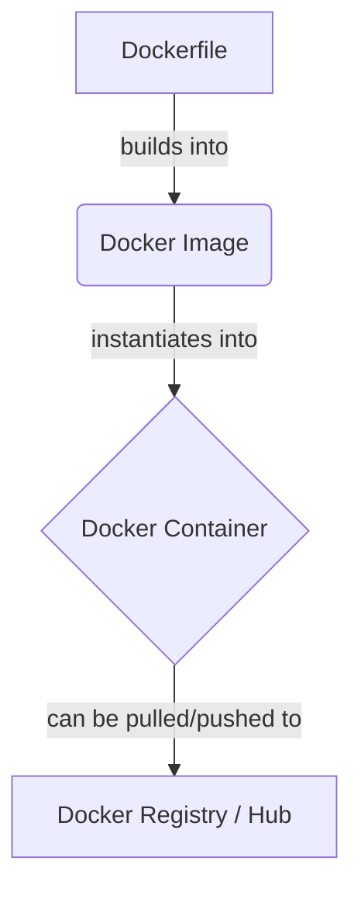

# Introduction to Docker: A Beginner's Guide

When developing applications, one of the most common and frustrating problems developers face is: **"But it works on my machine!"** 

Your app might run perfectly on your laptop, but when you deploy it to a production server (or when a colleague tries to run it), it breaks because of different operating systems, missing software packages, or conflicting versions.

**Docker** solves this problem by packaging your application and everything it needs to run into a single standardized unit called a **container**.

---

## 1. The Shipping Container Analogy (Layman's Terms)

Before standard shipping containers were invented, transporting goods on ships was chaotic. A single ship might carry cars, sacks of coffee beans, grand pianos, and boxes of bananas. Dockworkers had to figure out how to load, stack, and secure these mismatched items. If a car shifted, it could crush the bananas. If it rained, the coffee got wet.

Then came the **Standard Shipping Container**.

Now, cargo companies don't care what is inside. Whether it is a piano, a car, or bananas, it gets packed into a standard metal box of a fixed size. The cranes, trucks, and ships only need to know how to move and stack these standard boxes.

```
+-------------------------------------------------------------+
|  Your Laptop (Mac/Windows)   =======> Runs Docker Container  |
|  Staging Server (Linux)     =======> Runs Docker Container  |
|  Production Server (Cloud)   =======> Runs Docker Container  |
+-------------------------------------------------------------+
```

**Docker is shipping containers for software.**
*   **Your Code & Dependencies** (Node.js version, database drivers, configuration) are the **cargo**.
*   **Docker** packages them into a standard **software container**.
*   Any computer with Docker installed (whether a Mac, Windows PC, or Linux server) can run this container in the exact same way.

---

## 2. Containers vs. Virtual Machines (VMs)

You might wonder: *Isn't a container just a Virtual Machine (VM)?* Not quite. While both isolate applications, they do it differently:

| Feature | Virtual Machines (VMs) | Docker Containers |
| :--- | :--- | :--- |
| **Architecture** | Includes the app, libraries, **and a full Guest Operating System**. | Includes the app and libraries, but **shares the host OS kernel**. |
| **Size** | Very large (usually Gigabytes) because of the full OS. | Very lightweight (usually Megabytes). |
| **Boot Time** | Slow (takes minutes to boot the full OS). | Near-instant (takes seconds to start a process). |
| **Resource Efficiency** | High overhead (e.g., running 5 VMs means running 5 separate operating systems). | Extremely low overhead (shares system resources efficiently). |

> [!NOTE]
> Think of a VM as a **separate house** (fully independent with its own plumbing, heating, and foundation), while a Container is an **apartment in a building** (shares the building's infrastructure like water pipes and heating but remains private and secure).

---

## 3. Key Concepts in Docker

To understand Docker, you need to know these four fundamental building blocks:



1.  **Dockerfile:** A text file containing a list of instructions (a recipe) on how to build a Docker Image.
2.  **Docker Image:** A read-only template containing the application code, libraries, runtime environment, and settings. Think of it as the **blueprint** or the installation file (like an `.exe` or `.dmg` installer).
3.  **Docker Container:** A running instance of a Docker Image. If the image is the blueprint, the container is the **actual house** built from that blueprint. You can run, start, stop, move, or delete containers.
4.  **Docker Registry (Docker Hub):** A cloud service where you can store and share your Docker Images. Think of it as **GitHub but for Docker Images**.

---

## 4. The Dockerfile Instructions Explained

Here are the most common commands you write in a `Dockerfile`:

*   `FROM`: Sets the starting point (base image), like picking a foundation (e.g., `FROM node:20` starts with Node.js installed).
*   `WORKDIR`: Sets the working directory inside the container. All subsequent commands run here.
*   `COPY`: Copies files from your local computer into the container.
*   `RUN`: Executes commands *during* the image build process (e.g., installing packages via `npm install`).
*   `ENV`: Sets environment variables inside the container.
*   `EXPOSE`: Informs Docker that the container listens on specific network ports at runtime (mostly for documentation).
*   `CMD`: Specifies the command that runs automatically *when the container starts* (e.g., `npm start`).

---

## 5. Hands-On Example: Dockerizing a Node.js App

Let's build a simple Node.js application and run it inside a Docker container.

### Step 1: The Code
Create a simple directory structure with two files: `package.json` and `server.js`.

**`package.json`**
```json
{
  "name": "docker-demo",
  "version": "1.0.0",
  "main": "server.js",
  "dependencies": {
    "express": "^4.19.2"
  },
  "scripts": {
    "start": "node server.js"
  }
}
```

**`server.js`**
```javascript
const express = require('express');
const app = express();
const PORT = 3000;

app.get('/', (req, res) => {
  res.send('Hello from inside the Docker Container! 🐳');
});

app.listen(PORT, () => {
  console.log(`Application running on http://localhost:${PORT}`);
});
```

### Step 2: Create a `.dockerignore` File
Just like a `.gitignore` file, this tells Docker which files/folders *not* to copy into your image. This keeps your image small and fast to build.

**`.dockerignore`**
```text
node_modules
npm-debug.log
.git
```

### Step 3: Create the `Dockerfile`
Create a file named exactly `Dockerfile` (no extension) in the same directory.

**`Dockerfile`**
```dockerfile
# 1. Use the official lightweight Node.js image as the foundation
FROM node:20-alpine

# 2. Set the directory inside the container where our code will live
WORKDIR /usr/src/app

# 3. Copy package files first (helps with build speed caching)
COPY package*.json ./

# 4. Install dependencies inside the container
RUN npm install --only=production

# 5. Copy the rest of the application code
COPY . .

# 6. Tell Docker that the container will open port 3000
EXPOSE 3000

# 7. Define the command to start the application
CMD ["npm", "start"]
```

> [!TIP]
> **Why do we copy `package.json` and run `npm install` before copying the rest of the files?**
> Docker caches each line (layer) of the Dockerfile. If you only change your code in `server.js`, Docker will skip `npm install` and use the cached version. This makes builds take seconds instead of minutes!

### Step 4: Build the Image
Open your terminal in the project directory and run:

```bash
docker build -t my-express-app .
```
*   `docker build`: Tells Docker to compile an image.
*   `-t my-express-app`: Tags (names) the image `my-express-app`.
*   `.`: The dot means "look for the Dockerfile in the current folder".

### Step 5: Run the Container
Now, start a container from the image you just built:

```bash
docker run -d -p 3000:3000 --name my-running-container my-express-app
```
*   `docker run`: Tells Docker to create and start a container.
*   `-d`: Runs the container in the background (detached mode), freeing up your terminal.
*   `-p 3000:3000`: Maps port `3000` on your laptop to port `3000` inside the container.
*   `--name my-running-container`: Gives your container a friendly name.
*   `my-express-app`: The name of the image to run.

Open your browser and navigate to `http://localhost:3000`. You will see:
`Hello from inside the Docker Container! 🐳`

---

## 6. What is a `.dockerignore` File?

When you pack a suitcase for a trip, you don't throw in your dirty laundry pile or your heavy house trash can. You only pack what you need. 

Similarly, a `.dockerignore` file tells Docker which files and folders on your computer should **never** be copied into your Docker image.

### Why is a `.dockerignore` File Critical?

1.  **Massively Reduces Image Size:** The `node_modules` folder on your laptop can contain thousands of packages. We want Docker to install its own clean dependencies inside the container, not copy yours.
2.  **Prevents Operating System Clashes:** If you compile libraries on your Windows/Mac host machine, copying those compiled binaries into a Linux container will cause your application to crash.
3.  **Faster Builds (Build Context):** Before Docker builds an image, it has to prepare all files in the directory (called the *build context*). If it has to process 100MB of temporary or log files, the build starts very slowly.
4.  **Improves Security:** It prevents private configuration files containing passwords or API keys (like `.env` files) or Git history (`.git`) from getting baked into the public/production image.

### Example of a Standard `.dockerignore` File

```text
# Exclude the heavy local package folder
node_modules/

# Exclude git repository metadata
.git/
.gitignore

# Exclude private environment/secret files
.env
*.pem
*.key

# Exclude build logs and cache files
npm-debug.log*
yarn-debug.log*
yarn-error.log*
.npm/

# Exclude local build directories (compiled JS code)
dist/
build/
```

---

## 7. Docker Compose: Running Multiple Containers Together

Imagine you are coordinating a concert. A band is not just a singer; you need a guitarist, a drummer, and a keyboard player. If you had to call each musician one by one, tell them what song to play, what volume to set, and when to start, it would be exhausting and error-prone. 

Instead, you hire a **Conductor**. You give the conductor a script (**`docker-compose.yml`**) listing all the musicians (services) and how they should perform together. Then, you just tell the conductor: *"Start!"* and they coordinate everything at once.

**Docker Compose is the conductor for multi-container applications.**

### What Problem Does it Solve?
A modern web application rarely runs in isolation. It usually requires:
1.  A **Web Application container** (e.g., Node.js/Express)
2.  A **Database container** (e.g., MongoDB, PostgreSQL)
3.  A **Caching container** (e.g., Redis)

Instead of manually running three separate `docker run` commands and setting up custom networks so they can talk to each other, you define them in a single configuration file named `docker-compose.yml`.

### Example: `docker-compose.yml` for Node.js + MongoDB

Create a file named `docker-compose.yml` in the root of your project:

```yaml
version: '3.8'

services:
  # Service 1: Our Node.js Web App
  web-app:
    build: .                 # Build the image using the Dockerfile in the current directory
    ports:
      - "3000:3000"          # Map port 3000 on host to 3000 in container
    environment:
      - PORT=3000
      - MONGO_URI=mongodb://database:27017/myapp  # Connects to the database service below
    depends_on:
      - database             # Make sure the database starts before the web app

  # Service 2: A MongoDB Database
  database:
    image: mongo:6.0         # Download the official MongoDB image from Docker Hub
    ports:
      - "27017:27017"        # Map database port
    volumes:
      - mongo-data:/data/db  # Persist database data on our computer

# Define the volume so data isn't lost when we stop the container
volumes:
  mongo-data:
```

### Explaining the Key Fields:
*   `services`: Defines the list of containers you want to start.
*   `build: .`: Tells Docker to build the container from the local `Dockerfile`.
*   `image`: Tells Docker to download a pre-built image (like `mongo` or `postgres`) directly from Docker Hub instead of building one.
*   `depends_on`: Ensures the database starts before the web app container attempts to connect to it.
*   `volumes`: When containers are deleted, their internal data is deleted too. Volumes are folders on your computer that are mapped inside the container so your database data survives restarts.

---

## 8. Docker Networking

Think of Docker containers like houses inside a community. Just like houses need a way to communicate (roads, telephone wires, gates), Docker containers need a way to talk to each other and the outside world.

Docker uses three main types of networks:

#### A. Bridge Network (Default)
*   **The Analogy:** A gated community with a private telephone switchboard.
*   **How it works:** All containers inside the bridge network can talk to each other directly using their "names" (e.g., the backend container can ping the database container by writing `mongodb://database`).
*   **Outside Access:** If a computer outside the community (like your browser on your laptop) wants to access the web container inside, Docker must map a gate port (`-p 3000:3000`).
*   **Use case:** The standard network for almost all applications.

#### B. Host Network
*   **The Analogy:** A house built directly on a public highway with no gate or fence.
*   **How it works:** The container is not isolated. It shares the host computer's network interface directly. If your app runs on port `3000` inside the container, it immediately occupies port `3000` on your actual computer (no `-p` mapping needed).
*   **Use case:** High-performance apps where you want zero network overhead, or when running system tools.

#### C. None Network
*   **The Analogy:** A hermit cabin deep in the mountains with no roads, phone lines, or internet.
*   **How it works:** The container is completely offline. It cannot access the internet, and no local container or computer can access it.
*   **Use case:** Running highly secure batch jobs (like cryptography tools or database backups) where you want to guarantee zero network exposure.

### Key Networking Commands
*   `docker network ls` — List all networks on your system.
*   `docker network create my-custom-network` — Create a private network.
*   `docker run --network my-custom-network --name my-app my-image` — Start a container inside a specific network.

---

## 9. Volume Mounting (Data Persistence)

Think of a container like a hotel room. When you check in, you can write notes on the desk, put food in the mini-fridge, and rearrange the cushions. However, when you check out (or if the container is stopped/deleted), the cleaning staff resets the room to its original state. All your notes and food are thrown away.

If you want your files (like database records, user uploads, or logs) to survive, you must use **Volume Mounting** to store them in a "safety deposit box" outside the container.

Docker offers two main ways to mount storage:

```
+-----------------------------------------------------------+
|                  HOST MACHINE (Your Laptop)               |
|                                                           |
|  [ A. Named Volume ]           [ B. Bind Mount ]          |
|  (Managed by Docker in         (A specific folder you     |
|   a hidden directory)           select, e.g., ./src)       |
|          |                                |               |
+----------|--------------------------------|---------------+
           | (mounted inside)               | (mounted inside)
+----------v--------------------------------v---------------+
|                     DOCKER CONTAINER                      |
|                                                           |
|           /data/db                     /usr/src/app       |
+-----------------------------------------------------------+
```

#### A. Named Volumes (Recommended for Database Data)
*   **How it works:** You tell Docker, *"Create a storage box named `my-db-data`."* Docker creates this box in a hidden location on your host system and manages it for you.
*   **Best for:** Databases (like MongoDB, PostgreSQL, MySQL) where the container needs to write and read data, but you don't need to manually view or edit the files from your computer.
*   **Example command:**
    ```bash
    docker run -d -v my-db-data:/data/db mongo
    ```

#### B. Bind Mounts (Recommended for Development)
*   **How it works:** You point directly to a specific folder on your computer (e.g., `D:/my-project/src`) and map it directly into the container.
*   **Best for:** Hot-reloading during development. If you edit code inside your local `./src` folder, the container instantly sees the changes and refreshes without requiring a rebuild.
*   **Example command:**
    ```bash
    docker run -d -v D:/my-project:/usr/src/app -p 3000:3000 my-express-app
    ```

---

## 10. Efficient Caching (Layer Caching)

Imagine you bake a cake every day. The recipe is:
1.  Mix flour, sugar, and baking powder (Takes 5 minutes)
2.  Add vanilla extract (Takes 1 minute)
3.  Add fresh strawberries (Takes 2 minutes)

If the flour/sugar mix and vanilla extract never change, you can pre-make a batch, freeze it, and only add fresh strawberries each day. You save 6 minutes every time you bake!

This is exactly how **Docker Layer Caching** works. Every line in a `Dockerfile` creates a "layer". When you rebuild an image, Docker starts from the top. If a command and all the files it relies on haven't changed, Docker uses a pre-saved cache of that layer.

#### The Bad Way (Re-runs `npm install` on every single code change)
```dockerfile
FROM node:20-alpine
WORKDIR /usr/src/app
# Copy EVERYTHING first
COPY . .
# If we changed even 1 line of code in server.js, the COPY cache is busted.
# Docker is forced to run npm install from scratch!
RUN npm install
CMD ["npm", "start"]
```

#### The Good Way (Optimized Caching)
```dockerfile
FROM node:20-alpine
WORKDIR /usr/src/app
# Copy ONLY package files first
COPY package*.json ./
# Since packages rarely change, Docker skips this step and uses cache!
RUN npm install
# Now copy the rest of the application files
COPY . .
CMD ["npm", "start"]
```

---

## 11. Docker Multi-Stage Builds

Imagine you are making fresh orange juice to sell. To make it, you need a large, heavy juicer, cutting boards, boxes of oranges, and a trash can for the peels. However, you don't sell the juicer and the peels to the customer! You only put the final, clean juice into a small bottle and hand that to them.

In software development, building an application (especially in TypeScript, Go, Java, or React) requires heavy tools: compiler packages, testing frameworks, development dependencies (`devDependencies`). But once compiled, you only need the final production files (e.g., the `dist/` directory) to run the application.

**Multi-Stage builds allow you to use a heavy image for building, and copy only the final output into a lightweight image for running.**

#### Example: Multi-Stage `Dockerfile` for TypeScript App
```dockerfile
# ==========================================
# STAGE 1: Build / Compilation
# ==========================================
FROM node:20-alpine AS build-stage
WORKDIR /app
COPY package*.json ./
RUN npm install
COPY . .
# Compile TypeScript files into a production-ready 'dist/' folder
RUN npm run build

# ==========================================
# STAGE 2: Lightweight Production Runner
# ==========================================
FROM node:20-alpine AS production-stage
WORKDIR /app
# Copy only dependencies configuration
COPY package*.json ./
# Install ONLY production dependencies (ignores test libraries, devtools)
RUN npm install --only=production
# Copy ONLY the compiled javascript files from the build-stage
COPY --from=build-stage /app/dist ./dist

EXPOSE 3000
CMD ["node", "dist/server.js"]
```

> [!TIP]
> By using multi-stage builds, you can reduce your final production image size from **~1GB** down to **~150MB**, making it safer, faster to download, and more cost-effective to host in the cloud.

---

## 12. Essential Docker & Compose Commands

Here is a cheat sheet of commands you will use daily:

### Image Commands
*   `docker images` — List all downloaded/built images on your system.
*   `docker rmi <image_name>` — Remove a specific image.
*   `docker pull <image_name>` — Download an image from Docker Hub (e.g., `docker pull mongo`).

### Container Commands
*   `docker ps` — List all running containers.
*   `docker ps -a` — List all containers (running and stopped).
*   `docker stop <container_name_or_id>` — Stop a running container.
*   `docker start <container_name_or_id>` — Start a stopped container.
*   `docker rm <container_name_or_id>` — Delete a stopped container.
*   `docker logs <container_name_or_id>` — View the logs/console output of a running container.
*   `docker exec -it <container_name_or_id> sh` — Open a terminal inside the running container (great for debugging!).

### Docker Compose Commands
*   `docker compose up` — Starts all services defined in `docker-compose.yml`.
*   `docker compose up -d` — Starts all services in the background (detached mode).
*   `docker compose down` — Stops and removes all running containers, networks, and volumes defined in the compose file.
*   `docker compose logs -f` — View real-time logs from all running containers simultaneously.
*   `docker compose ps` — List the status of all containers managed by the compose file.

### System Commands
*   `docker system prune -a` — Clean up all unused containers, networks, images, and build caches to free up disk space.

---

## 13. Beginner Summary Checklist

- [ ] Understand that Docker containers package code + dependencies to run identically anywhere.
- [ ] Install Docker Desktop on your system.
- [ ] Always create a `.dockerignore` file to exclude heavy local folders like `node_modules` and secret files like `.env`.
- [ ] Keep images small by starting with lightweight base images (like `-alpine` tags).
- [ ] Copy dependencies (`package.json`) and run installations (`npm install`) before copying your source code to optimize build caching.
- [ ] Map host ports to container ports (`-p <host_port>:<container_port>`) when running web applications.
- [ ] Use **Docker Compose** when your application relies on multiple containers (like a database and backend).
- [ ] Configure Docker **Volumes** (Named Volumes or Bind Mounts) to ensure data is persistent.
- [ ] Understand the differences between **Bridge**, **Host**, and **None** networks.
- [ ] Build production images using **Multi-Stage Builds** to minimize image size and exclude developer dependencies.
- [ ] Clean up stopped containers and unused images regularly with `docker system prune`.
