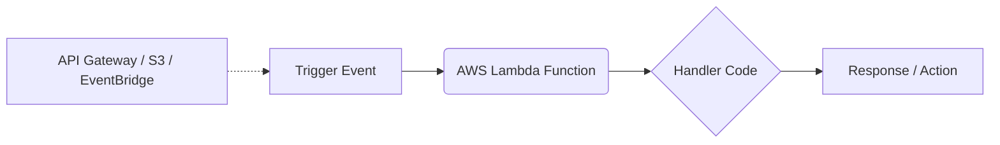

# AWS Lambda: A Beginner's Guide to Serverless

In traditional backend development, hosting a website or API requires buying or leasing a virtual server (like AWS EC2), installing an operating system, configuring Node.js/Python, and keeping the server running 24/7. You pay for the server every second, even if no users are visiting your site.

**AWS Lambda** introduces a model called **Serverless Computing**, where you upload only your code, and AWS manages the infrastructure, scaling, and execution for you.

---

## 1. What is Serverless & AWS Lambda? (Layman's Terms)

### The Catering Analogy

Imagine you want to serve meals to customers. 

*   **Traditional Hosting (EC2 / VPS):** This is like buying or leasing a physical food truck. You pay rent every month, pay for electricity, and service the engine, even if zero customers show up. You must keep the truck turned on and staffed just in case a customer arrives.
*   **Serverless Hosting (AWS Lambda):** This is like hiring an **on-demand catering service**. When a customer places an order (a request), a chef instantly drives over, cooks the meal, serves it, cleans up, and leaves. You *only* pay for the exact minutes the chef was cooking. If no customers order, you pay exactly $0.

```
+-------------------------------------------------------------+
| Traditional (EC2):  [Running Server] ---> Pay $20/month      |
|                                                             |
| Serverless (Lambda): [Dormant] -----------------> Pay $0    |
|                      [Triggered] -> Run (50ms) -> Pay $0.001 |
+-------------------------------------------------------------+
```

### Key Advantages of AWS Lambda
1.  **No Server Management:** You never patch operating systems, manage web servers (like Nginx), or install runtime updates.
2.  **Continuous Auto-Scaling:** If 1 user visits your site, Lambda runs 1 function instance. If 10,000 users visit simultaneously, Lambda automatically spins up 10,000 instances in seconds to handle the traffic.
3.  **Sub-Second Billing:** You are charged only for the number of requests and the milliseconds your code actually runs (rounded to the nearest millisecond).

---

## 2. How AWS Lambda Works (Triggers, Events, & Handlers)

AWS Lambda is **event-driven**. Your code does not run continuously; it sits dormant until an event wakes it up.



*   **Trigger:** The event source that wakes up your Lambda. Examples include:
    *   An HTTP request from a user (via **API Gateway**).
    *   A file upload to a storage bucket (via **S3**).
    *   A database insert or update (via **DynamoDB**).
    *   A scheduled time (e.g., "Run every day at 12:00 AM" via **EventBridge**).
*   **Event Object (`event`):** A JSON object passed to your function containing details about the trigger (e.g., the URL parameters, request body, or S3 file name).
*   **Context Object (`context`):** A JSON object containing details about the execution environment (e.g., function name, runtime, memory limit, and remaining time before timeout).
*   **Handler:** The entry-point function inside your code that AWS Lambda calls when triggered.

### Example Code: Basic Node.js Lambda Handler

```javascript
// index.js
exports.handler = async (event, context) => {
    console.log("Received Event:", JSON.stringify(event, null, 2));

    // Read a query parameter (e.g., http://api.com?name=Rahul)
    const name = event.queryStringParameters?.name || "Guest";

    // Return a structured response (format required by API Gateway)
    return {
        statusCode: 200,
        headers: {
            "Content-Type": "application/json"
        },
        body: JSON.stringify({
            message: `Hello ${name}! Welcome to AWS Lambda.`,
            requestId: context.awsRequestId // Accessing info from the context object
        })
    };
};
```

---

## 3. Core Concepts: Cold Starts vs. Warm Starts

Understanding how Lambda provisions containers is crucial for production performance.

### The Espresso Machine Analogy

*   **Cold Start:** When you walk into a coffee shop at 6:00 AM, the barista has to turn on the espresso machine, wait for the water to heat up, and clean the filter. This first coffee takes 5 minutes to serve.
*   **Warm Start:** When the next customer orders 2 minutes later, the machine is already hot and active. The barista serves the coffee in 15 seconds.

### How it Translates to Lambda
1. When a Lambda is triggered after being idle, AWS must create a virtual container environment, download your zip package, start the Node.js/Python runtime, and load your code. This delay is a **Cold Start** (takes 100ms to 3 seconds).
2. After the function finishes running, AWS keeps the container active ("warm") for a few minutes (usually 5 to 15 minutes) to handle subsequent requests. If another request arrives, it is processed instantly (**Warm Start**).

### How to Minimize Cold Starts
*   **Keep Package Sizes Small:** Exclude test files, documentation, and devDependencies.
*   **Use Lightweight Runtimes:** Node.js, Python, and Go boot up much faster than Java or .NET.
*   **Keep Code Outside the Handler:** Database connections and heavy libraries should be loaded outside the handler function so they are cached during warm starts.
*   **Provisioned Concurrency:** An AWS feature that keeps a specific number of containers pre-warmed at all times. This eliminates cold starts but incurs a flat hourly fee.

---

## 4. IAM Execution Roles & Permissions

A Lambda function is highly secure by default and cannot access any other AWS resources unless explicitly authorized.

*   An **IAM Execution Role** defines a set of permissions (policies) specifying what resources your Lambda is allowed to access (e.g., read files from S3, write logs to CloudWatch, or insert data into DynamoDB).
*   **Rule of Least Privilege:** Always grant only the minimum permissions your function needs to complete its task. Never grant admin (`*`) access.

---

## 5. Step-by-Step Guide: Creating and Testing a Lambda in the AWS Console

### Step 1: Navigate to Lambda
1. Log in to the **AWS Management Console**.
2. In the top search bar, type **Lambda** and select it under Services.

### Step 2: Create Function
1. Click the orange **Create function** button in the top right.
2. Select **Author from scratch** (default).
3. Configure the following:
   * **Function name:** `my-first-lambda`
   * **Runtime:** Select `Node.js 20.x` (or the latest LTS).
   * **Architecture:** Select `x86_64` (or `arm64` for slightly cheaper pricing).
   * **Permissions:** Expand *Change default execution role*. Leave it on *Create a new role with basic Lambda permissions*. This creates a role that automatically grants permissions to write logs to CloudWatch.
4. Click **Create function** at the bottom.

### Step 3: Write and Deploy Code
1. Scroll down to the **Code source** section. Double-click `index.mjs` in the file explorer.
2. Replace the default code with your handler logic.
3. Click the **Deploy** button above the editor. *Note: Changes do not take effect until deployed.*

### Step 4: Configure a Test Event and Run
1. Click the drop-down arrow next to the **Test** button and select **Configure test event**.
2. Set the following:
   * **Event name:** `MyTestEvent`
   * **Template:** Select `apigateway-aws-proxy` (if simulating an API Gateway trigger) or use `hello-world`.
   * **JSON Body:** Modify the payload if needed (e.g., add query string parameters).
3. Click **Save**.
4. Click **Test**. You will see a green execution box showing:
   * **Response:** The JSON response returned by your code.
   * **Logs:** The console logs written during execution.
   * **Duration:** The exact execution time (billed).

---

## 6. Step-by-Step Guide: Deploying and Invoking via AWS CLI

To deploy from your local terminal, make sure you have the AWS CLI installed and configured.

### Step 1: Set Up Project Files
Create a clean directory and initialize a Node.js project:
```bash
mkdir my-cli-lambda && cd my-cli-lambda
npm init -y
npm install uuid
```

Create `index.js` containing your function:
```javascript
const { v4: uuidv4 } = require('uuid');

exports.handler = async (event) => {
    console.log("Generating UUID for request...");
    return {
        statusCode: 200,
        body: JSON.stringify({
            message: "Successfully generated UUID!",
            id: uuidv4()
        })
    };
};
```

### Step 2: Package Code into a Zip File
AWS Lambda requires your code and `node_modules` to be uploaded in a flat zip file.

*   **On Windows (PowerShell):**
    ```powershell
    Compress-Archive -Path index.js, node_modules, package.json -DestinationPath function.zip
    ```
*   **On macOS/Linux (Terminal):**
    ```bash
    zip -r function.zip index.js node_modules package.json
    ```

### Step 3: Create the Execution Role via CLI
Before creating the function, you must create the IAM Role that allows the Lambda to run and write logs.

1. Create a trust policy file named `trust-policy.json`:
   ```json
   {
     "Version": "2012-10-17",
     "Statement": [
       {
         "Effect": "Allow",
         "Principal": {
           "Service": "lambda.amazonaws.com"
         },
         "Action": "sts:AssumeRole"
       }
     ]
   }
   ```
2. Create the IAM Role:
   ```bash
   aws iam create-role \
     --role-name my-lambda-cli-role \
     --assume-role-policy-document file://trust-policy.json
   ```
   *(Take note of the `"Arn"` returned in the JSON response, e.g., `arn:aws:iam::123456789012:role/my-lambda-cli-role`).*
3. Attach the basic execution policy to allow log writing:
   ```bash
   aws iam attach-role-policy \
     --role-name my-lambda-cli-role \
     --policy-arn arn:aws:iam::aws:policy/service-role/AWSLambdaBasicExecutionRole
   ```

### Step 4: Deploy the Lambda Function
Wait a few seconds for the IAM Role to propagate globally, then run:
```bash
aws lambda create-function \
  --function-name my-uuid-generator \
  --runtime nodejs20.x \
  --role arn:aws:iam::123456789012:role/my-lambda-cli-role \
  --handler index.handler \
  --zip-file fileb://function.zip
```
*   `--handler index.handler`: Directs Lambda to search for `index.js` and run the exported `handler` function.
*   `fileb://`: Prepares the CLI to upload binary data.

### Step 5: Invoke the Function
Trigger your Lambda from the terminal:
```bash
aws lambda invoke \
  --function-name my-uuid-generator \
  --cli-binary-format raw-in-base64-out \
  --payload '{"key": "value"}' \
  response.json
```
Read the output inside `response.json`:
```json
{
  "statusCode": 200,
  "body": "{\"message\":\"Successfully generated UUID!\",\"id\":\"2b2e88a3-29a3-4903-8dcf-b8d9b1a50a12\"}"
}
```

### Step 6: Updating Your Code
If you modify `index.js`, re-zip the files and push the update:
```bash
# Re-zip (On Linux/macOS)
zip -r function.zip index.js node_modules package.json

# Update AWS Lambda Deployment
aws lambda update-function-code \
  --function-name my-uuid-generator \
  --zip-file fileb://function.zip
```

---

## 7. Infrastructure-as-Code: The Serverless Framework

Manually zipping and uploading code using the console or CLI is error-prone. The **Serverless Framework** compiles your code, packages exclusions, creates necessary IAM roles, configures API Gateways, and handles deployments via a single config file `serverless.yml`.

### Example `serverless.yml` Configuration

```yaml
service: user-profile-service

frameworkVersion: '3'

provider:
  name: aws
  runtime: nodejs20.x
  region: us-east-1
  stage: ${opt:stage, 'dev'} # Deploys to dev by default, or use 'prod'
  memorySize: 512            # Sets default memory size (default is 1024MB)
  timeout: 10                # Sets execution timeout limit to 10 seconds
  environment:
    NODE_ENV: ${self:provider.stage}
    DB_HOST: my-production-db-instance.com

functions:
  getUser:
    handler: handlers/user.get
    events:
      - http:
          path: users/{id}
          method: get
          cors: true
  
  createUser:
    handler: handlers/user.create
    events:
      - http:
          path: users
          method: post
          cors: true

# Package configurations to keep sizes low
package:
  patterns:
    - '!test/**'
    - '!docs/**'
    - '!*.md'
    - '!.git/**'
```

### Essential Serverless Framework Commands
*   **Package Stack Locally:** Compile files and configurations into `.serverless/` without deploying.
    ```bash
    serverless package
    ```
*   **Deploy Entire Stack:** Deploys Lambda functions, IAM roles, logs, and API gateways.
    ```bash
    serverless deploy --stage prod
    ```
*   **Deploy Single Function (Fast Update):** Pushes code updates only, bypassing CloudFormation.
    ```bash
    serverless deploy function -f getUser
    ```
*   **Test Locally:** Run your Lambda on your local machine using simulated JSON events.
    ```bash
    serverless invoke local -f getUser --data '{"pathParameters": {"id": "123"}}'
    ```
*   **Tail Logs:** View live CloudWatch logs in your terminal.
    ```bash
    serverless logs -f getUser --tail
    ```
*   **Teardown:** Deletes all resources created by the framework.
    ```bash
    serverless remove
    ```

---

## 8. Hard and Soft Limits (Reference Table)

| Resource Metric | Limit | Type | Description |
| :--- | :--- | :--- | :--- |
| **Timeout Range** | 1 second to 15 minutes | Hard | Max duration code is allowed to run. |
| **Memory Allocation** | 128 MB to 10,240 MB | Hard | RAM allocated. CPU power scales proportionally. |
| **Payload Size (Request/Response)** | 6 MB (Synchronous) / 256 KB (Asynchronous) | Hard | Maximum size of input events and responses. |
| **Deployment Package Size** | 50 MB (zipped) / 250 MB (unzipped) | Hard | Includes code, dependencies, and layers. |
| **Temporary Storage (`/tmp`)** | 512 MB to 10,240 MB | Configurable | Ephemeral disk space available during execution. |
| **Account Concurrency Limit** | 1,000 (Default) | Soft | Maximum concurrent instances running across the region (request-based increase available). |

---

## 9. Troubleshooting & Common Gotchas

### A. Lambda Timeout Errors
*   **Symptom:** Logs show `Task timed out after 3.00 seconds` or similar.
*   **Causes:**
    *   The database connection is kept open, preventing the runtime environment from shutting down.
    *   The database is blocked by a security group (VPC routing issue).
    *   The request payload or API processing took longer than the configured timeout limit.
*   **Fixes:**
    *   Increase the timeout in your `serverless.yml` or AWS Console.
    *   If using Node.js, set `context.callbackWaitsForEmptyEventLoop = false;` to allow the Lambda execution to return the response immediately without waiting for database connections to close.
    *   Use connection pooling configurations (e.g. max connections = 1) to prevent exhaustion.

### B. Payload Too Large (`413 Payload Too Large`)
*   **Symptom:** Invocation fails with payload limits error.
*   **Fix:** If you need users to upload large files (e.g., 50MB files), do not send the file data through API Gateway and Lambda. Instead, use Lambda to generate an S3 **Pre-signed URL** and return it to the frontend, allowing the user to upload directly to S3.

### C. Cold Start Spikes in Production
*   **Symptom:** Occasionally, API requests take 2-3 seconds instead of the usual 100ms.
*   **Fixes:**
    *   Use lightweight package bundles. Utilize bundlers like Esbuild or Webpack to tree-shake and minify code.
    *   Move SDK and database instantiations outside of the handler function.
    *   Configure **Provisioned Concurrency** for high-traffic endpoints.

### D. Memory Exhaustion
*   **Symptom:** Logs show `Process exited before completing request` or `Memory Size: 128 MB Max Memory Used: 128 MB`.
*   **Fix:** Increase memory settings. If memory is close to the limit, allocate more memory (e.g. 512MB or 1024MB). Because CPU scales with memory, this often decreases runtime duration, neutralizing the cost increase.

---

## 10. AWS Lambda Production Summary Checklist

- [x] Write individual, single-purpose functions instead of packing monolithic APIs.
- [x] Initialize heavy client SDKs and database connections outside of the handler function.
- [x] Allocate appropriate memory (RAM) to balance execution speed and CPU performance.
- [x] Configure execution timeout limits to prevent infinite loops from running up charges.
- [x] Exclude testing files, configs, and `devDependencies` from the deployment zip.
- [x] Create and attach a specific IAM Execution Role utilizing the Rule of Least Privilege.
- [x] Use environment variables to supply runtime configurations and secrets.
- [x] Package Node.js source files along with the `node_modules` folder inside a single zip file.
- [x] Use **Infrastructure-as-Code (IaC)** tools like the **Serverless Framework** (`serverless.yml`) to manage and deploy your Lambda stack.
- [x] Inspect packaged sizes locally using `serverless package` to verify exclusions.
- [x] Optimize code updates by deploying single functions via `serverless deploy function -f <function_name>`.
- [x] Tear down unused stacks using `serverless remove` to avoid ongoing billing.
- [x] Keep check on the 1,000 default concurrency limit in your target AWS region.
