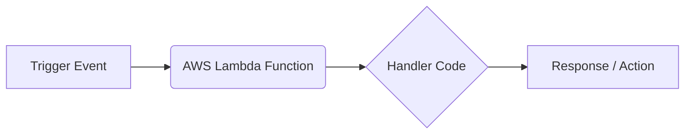

# AWS Lambda: A Beginner's Guide to Serverless

In traditional backend development, hosting a website or API requires buying or leasing a virtual server (like AWS EC2), installing an operating system, configuring Node.js/Python, and keeping the server running 24/7. You pay for the server every second, even if no users are visiting your site.

**AWS Lambda** introduces a model called **Serverless Computing**, where you upload only your code, and AWS manages the infrastructure, scaling, and execution for you.

---

## 1. What is Serverless & AWS Lambda? (Layman's Terms)

### The Catering Analogy

Imagine you want to serve meals to customers. 

*   **Traditional Hosting (EC2 / VPS):** This is like buying or leasing a physical food truck. You pay rent every month, pay for electricity, and service the engine, even if zero customers show up. You must keep the truck turned on and staffed just in case a customer arrives.
*   **Serverless Hosting (AWS Lambda):** This is like hiring an **on-demand catering service**. When a customer places an order (a request), a chef instantly drives over, cooks the meal, serves it, cleans up, and leaves. You *only* pay for the exact minutes the chef was cooking. If no customers order, you pay exactly $0.

```
+-------------------------------------------------------------+
| Traditional (EC2):  [Running Server] ---> Pay $20/month      |
|                                                             |
| Serverless (Lambda): [Dormant] -----------------> Pay $0    |
|                      [Triggered] -> Run (50ms) -> Pay $0.001 |
+-------------------------------------------------------------+
```

### Key Advantages of AWS Lambda
1.  **No Server Management:** You never patch operating systems, manage web servers (like Nginx), or install runtime updates.
2.  **Continuous Auto-Scaling:** If 1 user visits your site, Lambda runs 1 function instance. If 10,000 users visit simultaneously, Lambda automatically spins up 10,000 instances in seconds to handle the traffic.
3.  **Sub-Second Billing:** You are charged only for the number of requests and the milliseconds your code actually runs (rounded to the nearest millisecond).

---

## 2. How AWS Lambda Works (Triggers, Events, & Handlers)

AWS Lambda is **event-driven**. Your code does not run continuously; it sits dormant until an event wakes it up.



*   **Trigger:** The event source that wakes up your Lambda. Examples include:
    *   An HTTP request from a user (via **API Gateway**).
    *   A file upload to a storage bucket (via **S3**).
    *   A database insert or update (via **DynamoDB**).
    *   A scheduled time (e.g., "Run every day at 12:00 AM" via **EventBridge**).
*   **Event Object (`event`):** A JSON object passed to your function containing details about the trigger (e.g., the URL parameters, request body, or S3 file name).
*   **Context Object (`context`):** A JSON object containing details about the execution environment (e.g., function name, runtime, memory limit, and remaining time before timeout).
*   **Handler:** The entry-point function inside your code that AWS Lambda calls when triggered.

### Example Code: Basic Node.js Lambda Handler

```javascript
// index.js
exports.handler = async (event, context) => {
    console.log("Received Event:", JSON.stringify(event, null, 2));

    // Read a query parameter (e.g., http://api.com?name=Rahul)
    const name = event.queryStringParameters?.name || "Guest";

    // Return a structured response (format required by API Gateway)
    return {
        statusCode: 200,
        headers: {
            "Content-Type": "application/json"
        },
        body: JSON.stringify({
            message: `Hello ${name}! Welcome to AWS Lambda.`,
            requestId: context.awsRequestId // Accessing info from the context object
        })
    };
};
```

---

## 3. Core Concepts: Cold Starts vs. Warm Starts

Understanding how Lambda provisions containers is crucial for production performance.

### The Espresso Machine Analogy

*   **Cold Start:** When you walk into a coffee shop at 6:00 AM, the barista has to turn on the espresso machine, wait for the water to heat up, and clean the filter. This first coffee takes 5 minutes to serve.
*   **Warm Start:** When the next customer orders 2 minutes later, the machine is already hot and active. The barista serves the coffee in 15 seconds.

### How it Translates to Lambda
1.  When a Lambda is triggered after being idle, AWS must create a virtual container environment, download your zip package, start the Node.js/Python runtime, and load your code. This delay is a **Cold Start** (takes 100ms to 3 seconds).
2.  After the function finishes running, AWS keeps the container active ("warm") for a few minutes (usually 5 to 15 minutes) to handle subsequent requests. If another request arrives, it is processed instantly (**Warm Start**).

### How to Minimize Cold Starts
*   **Keep Package Sizes Small:** Exclude test files, documentation, and devDependencies.
*   **Use Lightweight Runtimes:** Node.js, Python, and Go boot up much faster than Java or .NET.
*   **Keep Code Outside the Handler:** Database connections and heavy libraries should be loaded outside the handler function so they are cached during warm starts.
*   **Provisioned Concurrency:** An AWS feature that keeps a specific number of containers pre-warmed at all times (costs extra).

---

## 4. IAM Execution Roles & Permissions

A Lambda function is highly secure by default and cannot access any other AWS resources unless explicitly authorized.

### The Employee ID Badge Analogy

When a catering contractor enters a corporate office, they aren't given keys to the CEO's office or the accounting vault. They are given a temporary **ID Badge** that allows access only to the kitchen and the dining hall.

*   An **IAM Execution Role** is that ID badge for your Lambda function.
*   It defines a set of permissions (policies) specifying what resources your Lambda is allowed to access (e.g., read files from S3, write logs to CloudWatch, or insert data into DynamoDB).
*   **Rule of Least Privilege:** Always grant only the minimum permissions your function needs to complete its task. Never grant admin (`*`) access.

---

## 5. Hands-On Deployment Examples (Console & CLI)

Let's look at how to package and deploy your Node.js Lambda function.

### Method A: Using the AWS Management Console (No Coding Tools)
1.  Log in to the **AWS Console**.
2.  Search for **Lambda** -> click **Create function**.
3.  Choose **Author from scratch**, name your function, and choose **Node.js 20.x** as the runtime.
4.  In the code editor, paste your JavaScript handler code.
5.  Click **Deploy**, then click **Test** to configure a mock event and run it.

---

### Method B: Deploying via AWS CLI (Terminal Commands)

To deploy from your local command line, make sure you have the [AWS CLI installed and configured](https://docs.aws.amazon.com/cli/latest/userguide/getting-started-install.html) with your access keys.

#### Step 1: Initialize Project and Code
Create a project folder and install a package (e.g., `uuid` to generate IDs).

```bash
mkdir my-lambda && cd my-lambda
npm init -y
npm install uuid
```

Create `index.js`:

```javascript
const { v4: uuidv4 } = require('uuid');

exports.handler = async (event) => {
    return {
        statusCode: 200,
        body: JSON.stringify({
            message: "Successfully generated a unique ID!",
            id: uuidv4()
        })
    };
};
```

#### Step 2: Package Code into a Zip File
AWS Lambda expects your code and its `node_modules` folder to be zipped.

*   **On Windows (PowerShell):**
    ```powershell
    Compress-Archive -Path index.js, node_modules, package.json -DestinationPath function.zip
    ```
*   **On macOS/Linux (Terminal):**
    ```bash
    zip -r function.zip index.js node_modules package.json
    ```

#### Step 3: Create the Lambda Function via CLI
Run the following command to deploy the zip file. 

> [!NOTE]
> You will need to replace the `--role` ARN below with your own IAM Lambda Execution Role ARN (created in the IAM console).

```bash
aws lambda create-function \
  --function-name my-uuid-generator \
  --runtime nodejs20.x \
  --role arn:aws:iam::123456789012:role/my-lambda-execution-role \
  --handler index.handler \
  --zip-file fileb://function.zip
```
*   `--function-name`: The name of your Lambda.
*   `--runtime`: The programming language version.
*   `--role`: The IAM Execution Role ARN giving the Lambda permission to run and write logs.
*   `--handler`: Pointing to `index.js` and the exported function name `handler` (`index.handler`).
*   `--zip-file`: Path to the local zip file (prefix `fileb://` is required).

#### Step 4: Invoke (Run) the Function
You can test the Lambda from your terminal:

```bash
aws lambda invoke \
  --function-name my-uuid-generator \
  --cli-binary-format raw-in-base64-out \
  response.json
```

Open `response.json` to view the output:

```json
{"statusCode":200,"body":"{\"message\":\"Successfully generated a unique ID!\",\"id\":\"a1b2c3d4-e5f6-7a8b-9c0d-1e2f3a4b5c6d\"}"}
```

#### Step 5: Updating Your Code
If you modify your JavaScript file, re-zip it and push the update:

```bash
# 1. Re-zip (On Windows PowerShell)
Remove-Item function.zip
Compress-Archive -Path index.js, node_modules, package.json -DestinationPath function.zip

# 2. Update Code
aws lambda update-function-code \
  --function-name my-uuid-generator \
  --zip-file fileb://function.zip
```

---

## 6. Infrastructure-as-Code: The Serverless Framework

Manually zipping your project, uploading it to AWS, setting up an IAM execution role, and configuring an API Gateway route via CLI commands is tedious and error-prone. 

To automate this, developers use **Infrastructure-as-Code (IaC)** tools. The most popular tool for AWS Lambda is the **Serverless Framework** (often installed as the `serverless` package).

### The Travel Agency Analogy

*   **Manual CLI/Console Deployment:** This is like booking a vacation yourself. You have to call the airline to buy tickets, call the hotel for rooms, call a car rental agency, and purchase travel insurance separately. If you miss one step, your vacation is ruined.
*   **Serverless Framework:** This is like using an **all-inclusive Travel Agency**. You write a single document listing where you want to go, what hotel you want, and your flight choices. The agency books and configures everything for you in one click.

With Serverless Framework, you define all your functions, triggers, and AWS permissions in a single file: `serverless.yml`.

### Step 1: Install Serverless CLI Globally
Install the framework command line interface via npm:

```bash
npm install -g serverless
```

### Step 2: Initialize a Project
Create a new Node.js template:

```bash
serverless create --template aws-nodejs --path my-serverless-api
cd my-serverless-api
```
This generates two key files:
1.  `serverless.yml`: Your configuration file.
2.  `handler.js`: Your Lambda JavaScript code.

### Step 3: Write the `serverless.yml` Configuration
Open `serverless.yml` and configure your API:

```yaml
service: my-serverless-api

provider:
  name: aws
  runtime: nodejs20.x
  region: us-east-1           # AWS region to deploy to
  stage: dev                  # Stage (dev, staging, prod)
  environment:
    DB_HOST: my-db-host.com   # Shared Environment variables

functions:
  # 1. Define our Lambda function name
  helloUser:
    handler: handler.hello    # Points to handler.js file and the hello function
    events:
      - http:                 # Automatically provisions API Gateway!
          path: user/hello    # URL path (e.g. https://api.com/dev/user/hello)
          method: get
          cors: true          # Enables CORS headers automatically
```

### Step 4: Write Your Lambda Code (`handler.js`)
```javascript
// handler.js
module.exports.hello = async (event) => {
  const name = event.queryStringParameters?.name || "Friend";

  return {
    statusCode: 200,
    headers: {
      "Access-Control-Allow-Origin": "*", // Match serverless.yml CORS config
    },
    body: JSON.stringify({
      message: `Hello ${name}! Successfully processed via Serverless Framework.`,
    }),
  };
};
```

### Step 5: Commands for Packaging and Deployment

#### A. Packaging Locally (Checking the Zip Bundle)
If you want to compile your code and see exactly what Serverless will upload to AWS without actually deploying it:
```bash
serverless package
```
This creates a hidden `.serverless/` folder containing the compiled CloudFormation templates and your code compressed into a `.zip` file. You can inspect this zip file to verify that unnecessary files (like test cases or devDependencies) are excluded.

#### B. Deploying the Entire Stack
To upload and deploy everything (Lambda, IAM Roles, API Gateway) to your AWS account:
```bash
serverless deploy
```
*Serverless compiles your stack, packages your code, uploads the zip to an S3 bucket it creates, updates AWS CloudFormation, and outputs the public HTTP URLs for your API endpoints.*

#### C. Fast Update: Deploying Code for a Single Function
If you only modified code in `handler.js` and did *not* change `serverless.yml`, deploying the full stack takes too long. Update just your code in seconds:
```bash
serverless deploy function -f helloUser
```

#### D. Local Test (Invoking locally without deploying)
Run your Lambda function on your local machine using a mock event structure:
```bash
serverless invoke local -f helloUser --data '{"queryStringParameters": {"name": "Rahul"}}'
```

#### E. Teardown / Remove
If you are done testing and want to delete all AWS resources created by this service to avoid accidental bills:
```bash
serverless remove
```

---

## 7. Pricing & Concurrency

### Pricing Breakdown
You are charged for two metrics:
1.  **Request Count:** $0.20 per 1 million requests.
2.  **Duration (GB-Seconds):** The time your code runs (in milliseconds) multiplied by the RAM allocated to your function.
    *   *Example:* If you assign 512MB RAM to a function and it runs for 100ms, it consumes `0.5 GB * 0.1 seconds = 0.05 GB-seconds`.

> [!TIP]
> **AWS Free Tier Benefit:** AWS offers 1 million free requests and 400,000 GB-seconds of compute time **every single month for free**, even after your first year of account creation. This makes running small, personal projects practically free.

### Concurrency Limits
*   By default, AWS limits your account to **1,000 concurrent executions** per region.
*   If your functions receive massive traffic surges and try to run more than 1,000 instances simultaneously, subsequent requests will be throttled (clients receive an HTTP `429 Too Many Requests` error). You can request limit increases from AWS support.

---

## 8. AWS Lambda Production Best Practices

-   **Keep Functions Single-Purpose:** Don't deploy a massive Express monolith into a single Lambda function ("Fat Lambda"). Instead, break your API endpoints into individual Lambda functions.
-   **Exclude devDependencies from Packages:** When using npm, make sure devTools and test frameworks aren't bundled into the deployment zip. You can enforce this in Serverless Framework by using the `serverless-plugin-typescript` or specifying exclude lists:
    ```yaml
    package:
      patterns:
        - '!test/**'
        - '!tsconfig.json'
    ```
-   **Reuse Connections (Global Cache):** Initialize database clients, AWS SDKs, and HTTP clients *outside* of the handler function. This reuses connections on warm starts:
    ```javascript
    // GOOD: Connection created ONCE during cold start
    const dbClient = new DatabaseConnection(); 
    
    exports.handler = async (event) => {
        // Reuses dbClient across warm starts
        return await dbClient.queryData(event.id); 
    };
    ```
-   **Optimize Memory Settings:** More memory doesn't just allocate RAM; AWS scales CPU power proportionally. If your function is slow, increasing memory from 128MB to 512MB might run the code 4x faster, reducing duration and making the execution cheaper.
-   **Configure Timeouts Wisely:** Set a realistic timeout limit (default is 3 seconds, max is 15 minutes). If a database query hangs, a high timeout means your Lambda will run (and bill you) until the timeout expires.
-   **Never Save Secrets in Plain Text:** Do not hardcode API keys or passwords. Use **Environment Variables** in Lambda settings, or load them from **AWS Secrets Manager**.

---

## 9. AWS Lambda Summary Checklist

- [ ] Write individual, single-purpose functions instead of packing monolithic APIs.
- [ ] Initialize heavy client SDKs and database connections outside of the handler function.
- [ ] Allocate appropriate memory (RAM) to balance execution speed and CPU performance.
- [ ] Configure execution timeout limits to prevent infinite loops from running up charges.
- [ ] Exclude testing files, configs, and `devDependencies` from the deployment zip.
- [ ] Create and attach a specific IAM Execution Role utilizing the Rule of Least Privilege.
- [ ] Use environment variables to supply runtime configurations and secrets.
- [ ] Package Node.js source files along with the `node_modules` folder inside a single zip file.
- [ ] Use **Infrastructure-as-Code (IaC)** tools like the **Serverless Framework** (`serverless.yml`) to manage and deploy your Lambda stack.
- [ ] Inspect packaged sizes locally using `serverless package` to verify exclusions.
- [ ] Optimize code updates by deploying single functions via `serverless deploy function -f <function_name>`.
- [ ] Tear down unused stacks using `serverless remove` to avoid ongoing billing.
- [ ] Keep check on the 1,000 default concurrency limit in your target AWS region.
